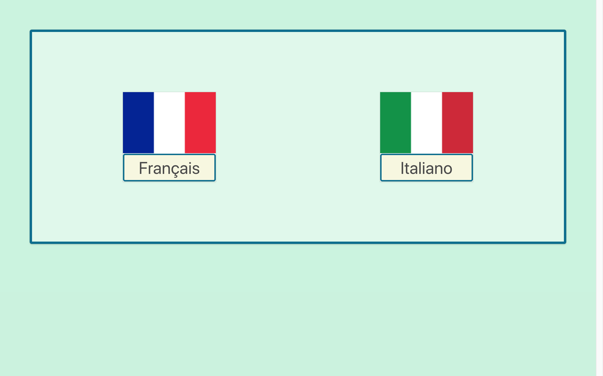

## Languages Game

View site: https://caroliner94.github.io/Project-1/

### Aim:
to create a web game as a first project on the GA WDI course.

### Technologies used:
* HTML5 & HTML5 Audio
* SCSS
* Bulma
* Javascript (ECMAScript 6) & jQuery
* Git & GitHub

### The Game:
The game is a language learning game. Users can select either French or Italian on the starting page, and will be taken through a series of questions in different formats.

### The process:
1. Once I had decided on the game, I started by considering the structure. I sketched out the sequence of screens for the path taken from the click on the French flag.
2. I opted to use Bulma to help structure my screens, so I browsed the site to establish which of their elements and components would be most suitable.
3. I then wrote some basic pseudocode to guide me through the Javascript part of the development.
4. The next step was to create the HTML file with one of each of the four question formats I had decided on, all for the French path.
5. I then wrote the Javascript using the basic logic I had created earlier, and added some initial CSS in addition to the styling from Bulma. I found some of this was difficult to overwrite so I downloaded Bulma and modified some of their variables, rather than working with the CDN link. At this point the game was working well for the French path.
6. At this stage I decided to refactor the code, as the initial version was reliant on a large number of constants and there was a lot of repetition. I created a second Javascript file (data.js), and moved all my HTML content into an array of objects in this file. With the remaining HTML I created four clearly labelled templates, which I then matched to functions in the initial Javacript file (app.js), commenting out all of my initial code.
7. With the French path working, I then added some code so the Italian path would rely on the same templates in the HTML and Javascript.

### Issues faced:
* Until the code refactoring, the development process was surprisingly smooth. However, when I started to write the functions, I struggled to add the logic to the functions to move between questions on the button click.
* The addition of the the Italian path took a while to comprehend, but with only a few lines of code I was able to double the functionality of the game.

### Future plans:
* Ideally each language would have more than four questions, and would have multiple levels. However, with the template framework I have created, expanding the number of questions will be quite straightforward.
* I would also like to add some other languages, and store user progress across them. Vocabulary lists with audio at the start of each level would be useful.
* In terms of design, I would add some more animations and images, as visual aids are known to be beneficial in language learning and retention.
